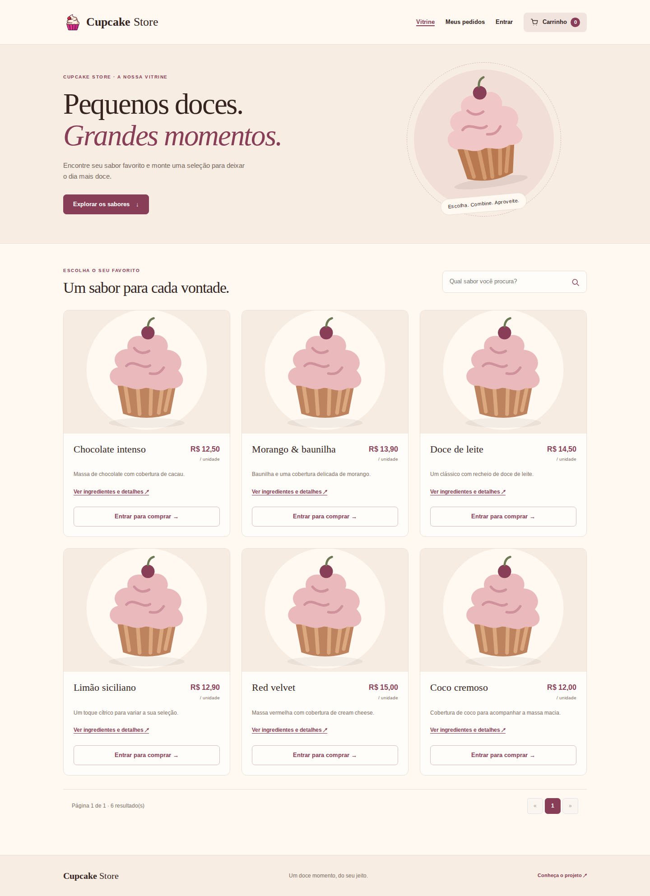
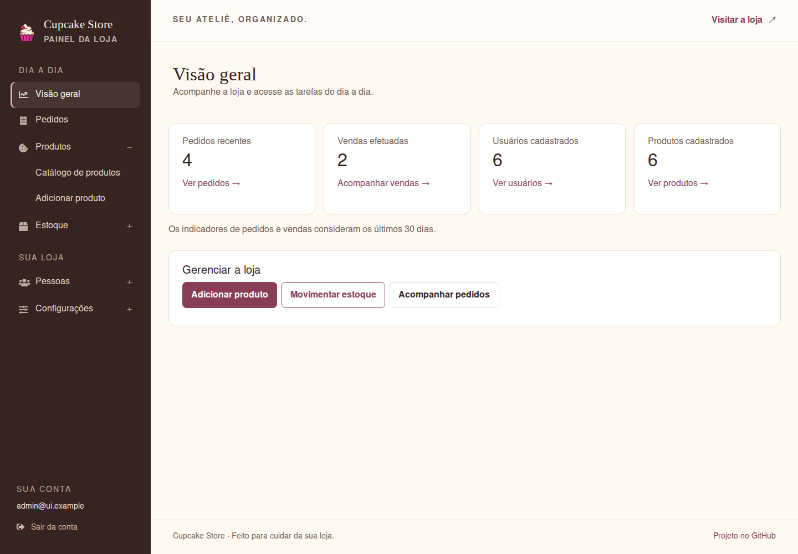

# Cupcake Store

Projeto Integrador Transdisciplinar em Engenharia de Software II - UNICID - Cruzeiro Sul Virtual

_Esse é um projeto que funcionará como uma loja online de cupcakes para uma pequena empresa. 
Ele faz parte de um trabalho acadêmico e utiliza conceitos aprendidos durante o curso. 
Tenha em mente que este é um projeto acadêmico e não atende aos requisitos para ser utilizado em produção._

 #### 🔥 Sinta-se à vontade para contribuir com o código (; 🔥

## Iniciar com Docker Compose

Com Docker e o plugin oficial Compose instalados:

```sh
docker compose up --build -d --wait
```

Abra `http://localhost:8080`. Banco e fotos ficam em volumes persistentes. Para criar o primeiro administrador, preencha `ADMIN_EMAIL` e `ADMIN_PASSWORD` no `.env` antes de iniciar; não há credencial padrão. Consulte o [guia de implantação](docs/DEPLOYMENT.md) para HTTPS, backups e importação de uma instalação existente.

## Como rodar o projeto *local* com Go?

Clone o repositório:
~~~sh
git clone https://github.com/bitebait/cupcakestore.git
~~~

Navegue até a pasta do projeto:
~~~sh
cd cupcakestore/
~~~

Crie um novo arquivo .env com base no .env.example e atualize suas configurações:
~~~sh
cp .env.example .env 
~~~

Instale as dependências nas versões fixadas no projeto:
~~~go
go mod download
~~~

Rode o projeto:
~~~go
go run .
~~~

### Configuração e validação

Use **Go 1.26 ou superior**, em uma versão estável com os patches atuais, além de um compilador C (CGO) para SQLite. Execute os comandos na raiz do repositório; templates e arquivos estáticos são carregados do disco, sem build frontend.

O arquivo `.env` é opcional. Variáveis já definidas no ambiente têm precedência. O padrão de desenvolvimento usa SQLite e `http://localhost:8080`.

Não há senha administrativa padrão. Para criar o primeiro administrador, defina `ADMIN_EMAIL` e `ADMIN_PASSWORD` (12 a 72 bytes) antes de iniciar. Uma conta existente não é promovida nem tem a senha sobrescrita pelo seed. Após a criação, remova essas variáveis do ambiente. Em bancos antigos, revise as contas criadas com a antiga senha pública.

O Pix começa desativado: configure a chave e habilite a forma de pagamento no painel. O pagamento em dinheiro permite testar a compra sem acessar um provedor externo.

```sh
go build ./...
go test ./...
go test -race ./...
go vet ./...
go run golang.org/x/vuln/cmd/govulncheck@latest ./...
```

Os testes usam bancos temporários e servidores HTTP locais. Há cobertura de autorização, CSRF, cadastro, carrinho, checkout, concorrência no estoque, cancelamento e renderização de templates. A CI executa build, testes com detector de corrida, vet, verificação de formatação e `govulncheck`, além de construir e iniciar a aplicação com Docker Compose.

O backend usa **Fiber 3.5**, com validação integrada ao binding, sessões por middleware, renovação de sessão/CSRF no login e APIs atuais de contexto, redirecionamento e arquivos estáticos. Sessões expiram após uma hora de inatividade ou 24 horas no total; permanecem em memória e são encerradas ao reiniciar.

Consulte a [auditoria e plano de evolução](docs/AUDIT.md) para decisões de arquitetura, compatibilidade de dados e pendências conhecidas.

### Frontend

A loja, o checkout, a autenticação e o painel compartilham uma interface responsiva. Formulários funcionam em HTML e os comportamentos ficam em três arquivos JavaScript próprios, sem jQuery ou build frontend. Veja o [guia de manutenção](docs/FRONTEND.md) e as [capturas atuais](docs/screenshots/).

O carrinho permite editar quantidades diretamente. O painel oferece apenas etapas válidas para cada pedido e preserva a taxa de entrega registrada ao atualizar seu andamento. Um Pix já emitido é reutilizado ao reabrir o pagamento; a aprovação exige conferência bancária pelo administrador. Cancelar o pedido localmente não cancela a cobrança no provedor nem devolve dinheiro automaticamente.

### Informações Adicionais

- **Linguagem Back-end**: Golang
- **Front-end**: HTML+CSS+JS ([AdminLTE Bootstrap Admin Dashboard](https://adminlte.io/))
- **Banco de Dados**: Sqlite3 (usando gorm – Golang ORM)
- **Hospedagem**: Linode (VPS) + Cloudflare
- **Plataforma**: Web (responsivo para tablet, smartphone e web)

### Estrutura do Projeto

A estrutura do projeto é organizada da seguinte forma:

- `bootstrap`: *Contém arquivos relacionados à inicialização do projeto.*
- `config`: *Responsável pelas configurações do ambiente.*
- `controllers`: *Engloba os controladores da aplicação.*
- `database`: *Arquivos relativos ao banco de dados, incluindo scripts de inicialização.*
- `docs`: *Documentação do projeto.*
- `middlewares`: *Implementação de middlewares, como controle de autenticação.*
- `models`: *Define os modelos de dados utilizados na aplicação.*
- `repositories`: *Responsável pelo acesso e manipulação dos dados.*
- `routers`: *Configuração das rotas da aplicação.*
- `services`: *Serviços oferecidos pela aplicação.*
- `session`: *Gerenciamento de sessões de usuário.*
- `helpers`: *Utilitários compartilhados.*
- `views`: *Templates e arquivos relacionados à visualização da aplicação.*
- `web`: *Recursos web, como favicons, imagens, assets, etc.*

### Autoria

Este projeto foi desenvolvido por William Schwaab (<william@schwaab.me>) como parte do Projeto Integrador Transdisciplinar em Engenharia de Software II - UNICID - Cruzeiro Sul Virtual.

Consulte o [índice da documentação](docs/README.md) para os guias atuais e o [arquivo acadêmico](docs/archive/README.md) para os documentos originais.


## Imagens

- **Loja:**
  

- **Painel de Admin:**
  
